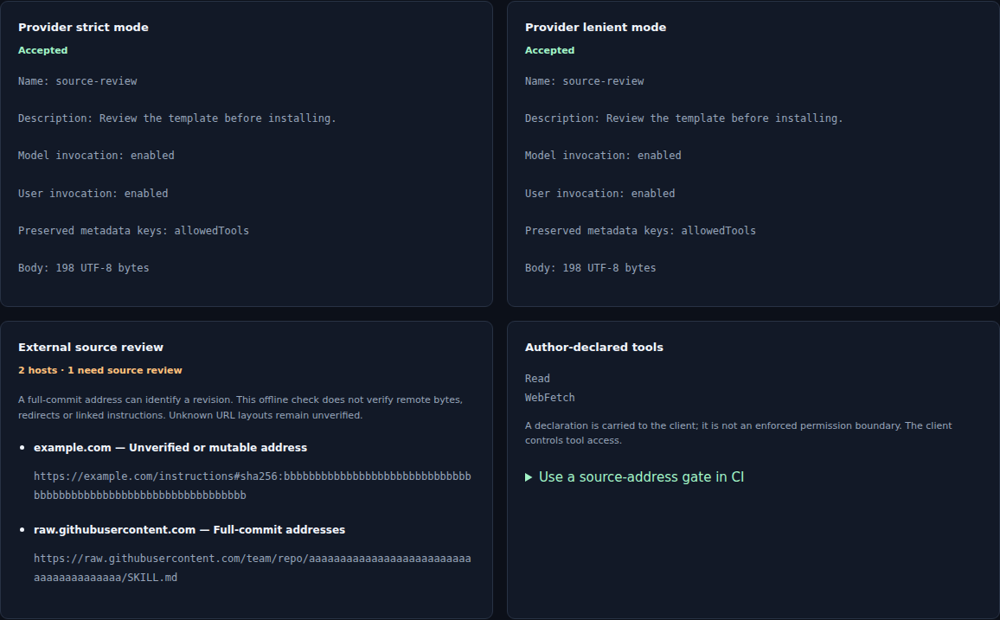
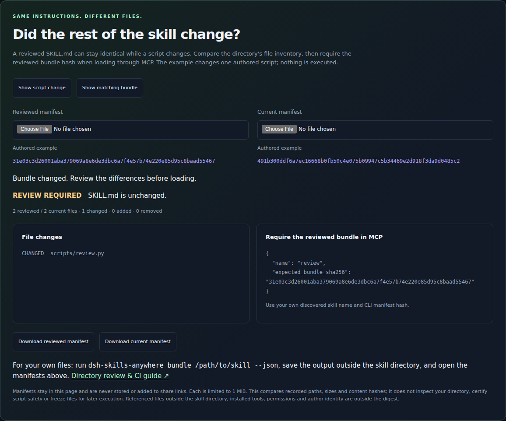

# dsh-skills-anywhere

**Discover and load skills across your tools.** Collect [Agent Skills](https://agentskills.io)
from local directories and configured Git sources into one catalog, available
through a live [DeepSeek Harness](https://github.com/deepseek-ai/deepseek-harness)
(`dsh`) provider or a local stdio MCP server.

English | [中文](README.zh.md)

**[Try the interactive Hugging Face playground](https://huggingface.co/spaces/glayguo/dsh-skills-anywhere)** — explore an example workspace, resolve name clashes, and search beyond the catalog budget. No installation or model API needed. [How it works](docs/HUGGINGFACE.md).

Inspect skill instructions, compare directory manifests and share catalog views.
Keyboard navigation preserves the selected row and catalog settings. Files
opened for local review stay in the browser.

**Bring your own `SKILL.md`.** Compare the provider's strict and lenient parsing
locally: inspect repairs, invocation settings and a downloadable check report.
Your file stays in the browser. The same checks are available in the
[command line and CI](docs/CHECKING.md), with file hashes and actionable exit codes.
Reports enumerate recognized source URLs, full-commit address forms and
author-declared tools. Referenced content, script behavior and client
compatibility require separate verification.

[](https://huggingface.co/spaces/glayguo/dsh-skills-anywhere)

[](https://github.com/noteflowai/dsh-skills-anywhere/actions/workflows/ci.yml)
[](https://www.npmjs.com/package/dsh-skills-anywhere)
[](https://github.com/topics/dsh-plugin)
[](https://scorecard.dev/viewer/?uri=github.com/noteflowai/dsh-skills-anywhere)
[](https://glama.ai/mcp/servers/noteflowai/dsh-skills-anywhere)
[](LICENSE)

Listed in community directories: [Awesome DeepSeek Harness](https://github.com/Dominic789654/awesome-deepseek-harness) · [Awesome Gemini CLI](https://github.com/Piebald-AI/awesome-gemini-cli). [Publication record](docs/PROMOTION.md).

Clients can use different project, user and plugin directories for `SKILL.md`
files. Skills Anywhere discovers configured sources in place and makes the
resulting catalog available through dsh or an MCP client configured to connect
to its local server. Directory definitions describe discovery paths; the
[compatibility matrix](docs/MCP-COMPATIBILITY.md) records tested protocol
connections separately.

<p align="center"></p>

Inside dsh, it registers one extra provider on the built-in `ctx.skills` registry, so the model's normal `skill` tool and `/name` invocation simply see more skills:

- **Predefined agent directories.** Project and user paths for Claude Code, Codex, Cursor, Gemini CLI, GitHub Copilot, Windsurf, Kiro, Goose and other entries in the [directory registry](src/agents.ts).
- **Claude Code plugin marketplaces.** The skills nested inside `~/.claude/plugins/marketplaces/*/plugins/*/skills/*`, including the official Anthropic marketplace.
- **Configured Git sources.** Select a skill repository, subdirectory, branch, tag or commit. The provider maintains a local checkout and records its resolved commit in a lock file.
- **Local files read in place.** Existing skills are re-read when loaded, without copying them into each client's directory. Git sources use the managed cache described below.

Hundreds of skills would bloat every model request, so the provider keeps a **catalog budget**: at most 50 skills enter the model's session catalog by default, and the rest stay one `find_skills` call away through two small tools the plugin adds, with `/name` invocation untouched.

The same pool is available **outside dsh** through `dsh-skills-anywhere mcp`.
Configured [MCP](https://modelcontextprotocol.io) clients can discover and open
skills through tools and `skill://` resources. Client support for tool calls,
resources and the skill's own instructions determines the available workflow.

The provider **deduplicates** symlinked and byte-identical entries, supports
documented frontmatter **repairs**, and **renames** conflicting names such as
`discord/configure` and `telegram/configure`. The CLI reports the published
catalog, skipped entries and the reason for each change.

## Inspect skill delivery

Successful MCP `open_skill` calls return a receipt identifying the delivered
instruction body, original SKILL.md and optional bundle. Attach it to a tool
span to review delivered versions alongside task results. The receipt records
delivery; instruction following and permission enforcement are separate checks.
[Receipt contract](docs/LOAD-RECEIPTS.md) ·
[EvalArc Trace Workbench](https://noteflowai.github.io/evalarc/trace-workbench/index.html).

## Example: review robot evidence

Load a Microduck frame-review skill through MCP, then have your agent verify
its recorded joint facts with Robot Reel before writing a review.
[Interactive skill example](https://huggingface.co/spaces/glayguo/dsh-skills-anywhere)
(select **04 Review robot evidence**) · [Local walkthrough](docs/PHYSICAL_AI.md) ·
[Reusable skill](examples/robot-reel-review/SKILL.md).
The browser shows the instructions; your agent's own execution tool runs the
read-only verifier. No new simulation or GPU is needed.

## Review once, load the same file

MCP `open_skill` returns the original file's SHA-256. Supply
`expected_sha256` from `check --json` or an earlier open to reject a changed
`SKILL.md` before its instructions are returned. Fresh author opt-outs apply
immediately, even while discovery is cached. [Exact-file workflow](docs/VERIFIED-LOADS.md).

**MCP protocol support:** the local stdio command negotiates legacy initialization
and the 2026-07-28 protocol opening. Four SDK configurations and the installed
npm archive are checked over real subprocess connections.
[Compatibility matrix and embedding migration](docs/MCP-COMPATIBILITY.md).

**Review the whole skill directory.** Generate a file manifest with
`bundle /path/to/skill --json`, compare added/removed/changed resources, and
require `expected_bundle_sha256` when opening through MCP. The
[interactive bundle comparison](https://huggingface.co/spaces/glayguo/dsh-skills-anywhere)
shows a script change behind unchanged instructions and compares your own
manifests locally. [Directory review and limits](docs/BUNDLES.md).

[](https://huggingface.co/spaces/glayguo/dsh-skills-anywhere)

## Quick start

```sh
# 1. Install into the dsh profile you use (web is the default UI profile)
dsh plugin --profile web add dsh-skills-anywhere

# 2. See what the model will get, without booting dsh
npx dsh-skills-anywhere list

# 3. Add a whole repository of skills
npx dsh-skills-anywhere add anthropics/skills
```

Published on [npm](https://www.npmjs.com/package/dsh-skills-anywhere) with build provenance; every [GitHub release](https://github.com/noteflowai/dsh-skills-anywhere/releases) also carries the same tarball.

Start dsh as usual. The skill catalog now includes everything above; load a skill with the `skill` tool or `/skill-name` exactly as before.

Example discovery output is shown below. Paths and counts depend on the local
installation and configured sources:

```
$ npx dsh-skills-anywhere list
NAME                 FROM                                                    PATH
discord-access       claude plugin discord @ claude-plugins-official         ~/.claude/plugins/marketplaces/.../discord/skills/access/SKILL.md
frontend-design      claude plugin frontend-design @ claude-plugins-official ~/.claude/plugins/marketplaces/.../frontend-design/skills/frontend-design/SKILL.md
skill-creator        claude plugin skill-creator @ claude-plugins-official   ~/.claude/plugins/marketplaces/.../skill-creator/skills/skill-creator/SKILL.md
...
31 skills, 6 renamed — run `dsh-skills-anywhere doctor` for details
```

<details>
<summary>Install from a git checkout or a release tarball instead of npm</summary>

Every [GitHub release](https://github.com/noteflowai/dsh-skills-anywhere/releases) carries a prebuilt tarball, and both `dsh plugin add` and `npx` accept its URL directly (`https://github.com/noteflowai/dsh-skills-anywhere/releases/download/v0.12.0/dsh-skills-anywhere-0.12.0.tgz`). If you want an unreleased commit:

```sh
dsh plugin --profile web add github:noteflowai/dsh-skills-anywhere
```

A git install ships sources, so pnpm has to run this package's `prepare` build. pnpm 10+ refuses until you allow it: the first `add` fails and prints the exact key to allow. Copy that key (it includes the commit) into the profile's `pnpm-workspace.yaml` and run the `add` again.

```yaml
# $DSH_HOME/profiles/web/pnpm-workspace.yaml
allowBuilds:
  'dsh-skills-anywhere@https://codeload.github.com/noteflowai/dsh-skills-anywhere/tar.gz/<sha>': true
```

Pin a commit (`github:noteflowai/dsh-skills-anywhere#<sha>`) if you want the install to be reproducible.

</details>

<details>
<summary>Requirements</summary>

- DeepSeek Harness `0.1.5-rc.1` or newer (the suite runs against `0.1.5-rc.1` and `0.1.5-rc.2`), any profile that mounts `@deepseek-ai/dsh-skill` (the shipped `web`, `acp`, `headless` and `sdk` profiles all do)
- Node.js 22.19+ or 24+
- `git` on `PATH` for git sources (everything else works without it)

</details>

## What gets discovered

| Where | Example | dsh source label | Default rank |
|---|---|---|---|
| Another agent's **project** skills | `<project>/.claude/skills/*` | `anywhere-project` | 250 |
| Another agent's **user** skills | `~/.codex/skills/*`, `~/.cursor/skills/*` | `anywhere-user` | 550 |
| **Claude Code plugin marketplaces** and the installed-plugin cache | `~/.claude/plugins/marketplaces/*/plugins/*/skills/*` | `anywhere-claude-plugins` | 580 |
| **Git sources** | `anthropics/skills`, `vercel-labs/agent-skills/skills` | `anywhere-source` | 700 |

Lower rank wins a duplicate name inside the dsh registry. The built-in dsh roots
keep their ranks (`.dsh/skills` 100, `.agents/skills` 200, `~/.dsh/skills` 400,
`~/.agents/skills` 500). Precedence follows these values across sources; for
example, an agent's project entry at rank 250 precedes a dsh user entry at 400.
The built-in `.agents/skills` and `.dsh/skills` roots are not scanned again.

Run `npx dsh-skills-anywhere agents` for the full agent table and which directories exist on your machine.

### Skill format

Any directory with a `SKILL.md` following the [Agent Skills specification](https://agentskills.io/specification), plus dsh's flat `<name>.md` form. `name`, `description`, `license`, `compatibility`, `allowed-tools`, `metadata`, and dsh's `disable-model-invocation` / `user-invocable` are all understood. Unknown frontmatter (Claude Code's `argument-hint`, `context`, ...) is preserved under `metadata.frontmatter`. `scripts/`, `references/` and `assets/` are exposed through the skill's resource directory like any dsh skill.

In the default **lenient** mode a missing name falls back to the directory, an invalid name is normalised to kebab-case, and a missing description is derived from the first paragraph. Each repair is recorded and shown by `doctor`. Set `lenient: false` to match the strict behaviour of the built-in provider.

## Git sources

```sh
npx dsh-skills-anywhere add anthropics/skills                      # default branch
npx dsh-skills-anywhere add anthropics/skills@v1.0.0               # tag or branch
npx dsh-skills-anywhere add vercel-labs/agent-skills/skills        # sub-directory
npx dsh-skills-anywhere add https://github.com/o/r/tree/main/dir   # GitHub tree URL
npx dsh-skills-anywhere add git@gitlab.com:group/skills.git        # any git URL
npx dsh-skills-anywhere add ./local/skills-repo --project          # local repo, project-scoped
npx dsh-skills-anywhere add o/r --ref 3f2a9c1 --rank 300           # pin a commit, set precedence
```

Sources come from three places, merged in this order: the plugin `config.sources`, the user file `~/.dsh/skills-anywhere/sources.json`, and the project file `<project>/.dsh/skills-anywhere.json` (commit it to share skills with your team). The CLI edits the last two.

Each repository uses a local checkout at
`~/.dsh/skills-anywhere/cache/<host>/<owner>/<repo>` (`<repo>@<ref>` when a
branch, tag or commit is set). Background synchronization runs at startup,
every `syncIntervalMs` (6 hours by default), and when source configuration changes.
Resolved commits are recorded in `~/.dsh/skills-anywhere/lock.json`.
Discovery reads the available cache. A failed refresh retains an existing
checkout; a source that has never synchronized contributes no cached skills.
Successful changes invalidate the catalog without making discovery wait for
network synchronization.

## Catalog budget and the `find_skills` / `open_skill` tools

dsh publishes every model-invocable skill's name and description into the session, on every request. With marketplaces and a few git sources that is hundreds of lines of context. The provider therefore ranks its skills and marks only the first `catalog.limit` (default 50) as model-invocable; the remainder is published with model invocation off, which keeps it out of the catalog but still loadable by you with `/name`.

Two tools, registered by the `dsh-skills-anywhere/tools` row, make the hidden part reachable for the model:

- **`find_skills(query, limit?)`** searches every skill by keyword (name, description, `whenToUse`, origin), catalog or not, and says which matches are listed.
- **`open_skill(name)`** loads any skill by exact name, including ones the budget hid. Skills whose own frontmatter says `disable-model-invocation: true` are still refused, exactly as the built-in `skill` tool does.

```yaml
- id: skills-anywhere
  config:
    catalog:
      limit: 30                       # 0 = unlimited (old behaviour)
      pin: [frontend-design]          # always listed
      hide: [example-skill]           # never listed, still searchable and /name-invocable
- id: skills-anywhere-tools
  config:
    findLimit: 10
```

Author-disabled skills never count against the budget. Which skills stay listed follows the precedence order below, so project-level skills win over user-level, which win over marketplaces and git sources. The tools row needs the tool runtime (`ctx.tools`); in a profile without one it stays pending and the provider works alone.

## CLI

**Check before committing.** Run `npx -y dsh-skills-anywhere@0.12.0 check
skills/example/SKILL.md --fail-on-repair`. The same parser used in the playground
provides batch file checks, JSON reports with file hashes, and CI exit codes.
Checks read only the named files. [Commands, CI example and scope](docs/CHECKING.md).

```
dsh-skills-anywhere list [--all] [--json]     Skills the provider publishes (--all shows hidden duplicates)
dsh-skills-anywhere agents [--json]           Agent directory definitions and paths found here
dsh-skills-anywhere sources [--json]          Configured git sources and their synced commits
dsh-skills-anywhere add <source> [--ref] [--path] [--rank] [--project]
dsh-skills-anywhere remove <source> [--project]
dsh-skills-anywhere sync [--force] [--json]   Clone or refresh every source now
dsh-skills-anywhere doctor [--json]           Repaired, skipped, renamed and duplicate skills, with reasons
dsh-skills-anywhere check <files...> [--json] Explicit local files; strict parser gate by default
dsh-skills-anywhere mcp                       Serve skills to configured clients over stdio MCP
```

All commands accept `--cwd <dir>`. For `check`, it resolves the named files; other
commands use it to pick the project. `check --lenient` accepts provider repairs;
`--fail-on-repair` rejects any reported repair in the selected mode.
The CLI uses the same parsing code as the plugin and never needs dsh running.

## Use as an MCP server

`dsh-skills-anywhere mcp` starts a local
[Model Context Protocol](https://modelcontextprotocol.io) server over stdio.
It exposes the same configured sources, deduplication and naming rules through
the following tools. Connect a compatible client using its MCP configuration:

| Tool | What it does |
| --- | --- |
| `list_skills` | Browse every model-invocable skill with its description and origin (`limit`, `offset`) |
| `find_skills` | Keyword search across names, descriptions and origins |
| `open_skill` | Load one skill's instructions plus the directory its scripts and references live in |

Skills are also exposed as `skill://<name>` resources (with completion), for clients that let you @-mention resources. Skills whose frontmatter sets `disable-model-invocation: true` are never listed or opened. The server needs no dsh installation at all.

**Claude Code** (as a plugin; this repo doubles as a plugin marketplace)

```sh
claude plugin marketplace add noteflowai/dsh-skills-anywhere
claude plugin install dsh-skills-anywhere@noteflowai
```

Or register the bare server instead: `claude mcp add skills-anywhere -- npx -y dsh-skills-anywhere mcp`. Either way, restart Claude Code once so it connects.

**Cursor** (`.cursor/mcp.json` or `~/.cursor/mcp.json`)

```json
{ "mcpServers": { "skills-anywhere": { "command": "npx", "args": ["-y", "dsh-skills-anywhere", "mcp"] } } }
```

**Codex** (`~/.codex/config.toml`)

```toml
[mcp_servers.skills-anywhere]
command = "npx"
args = ["-y", "dsh-skills-anywhere", "mcp"]
```

The server is also listed in the [official MCP registry](https://registry.modelcontextprotocol.io) as `io.github.noteflowai/dsh-skills-anywhere`, so registry-aware clients can install it by name. The repository is also an [Agent Plugin](https://agent-plugins.org) (`plugin.json` + `mcp.json` at the root), so Cursor and other open-plugin clients can install it from the repository URL. Add `--cwd <dir>` when the client does not start the server inside the project you are working on. Git sources sync in the background on start, exactly as in dsh. Programmatic use: `import { createSkillsAnywhereServer } from 'dsh-skills-anywhere/mcp'` returns the `McpServer` and the provider so you can attach your own transport.

## Browse and toggle skills in the dsh web UI

In `dsh web`, open **Settings → Plugins → Plugin configuration**. The **Skills Anywhere** card lists every skill the provider found, grouped by where it lives (agent directories, Claude Code plugins, git sources), with its catalog state — *listed* for the model, *not listed* (kept out by the budget or by you) or *author disabled* — and the name it was renamed to when it collided. Each row offers **Pin** (always listed), **Hide** (out of the model catalog, still `/name`- and `find_skills`-reachable) and **Exclude** (dropped from the provider); the catalog budget is editable in place, and a filter box searches names, descriptions and origins.

<p align="center"></p>

Edits are written to the profile's dsh settings document as the `skills-anywhere` namespace, layered over `catalog` and `excludeSkills` from `cordis.patch.yml`, and the model catalog follows immediately: no restart, no file editing. The card only appears in profiles that mount dsh's settings service and web server (the shipped `web` profile does); everywhere else the provider behaves exactly as composed.

## Configuration

Override the row in your profile's `cordis.patch.yml`. A patch replaces the whole `config` block, so restate every key you care about:

```yaml
- id: skills-anywhere
  config:
    agents: true
    excludeAgents: [openclaw]
    claudePlugins: true
    sources:
      - anthropics/skills
      - { repo: vercel-labs/agent-skills, path: skills, ref: main, rank: 650 }
    excludeSkills: [example-skill]
```

| Field | Default | Meaning |
|---|---|---|
| `providerName` | `skills-anywhere` | Provider name on `ctx.skills` |
| `agents` | `true` | Scan other agents' skill directories |
| `excludeAgents` | `[]` | Agent ids to skip (see `agents` command) |
| `extraProjectDirs` | `[]` | Additional project-relative skill directories |
| `extraUserDirs` | `[]` | Additional absolute or `~/` skill directories |
| `claudePlugins` | `true` | Scan Claude Code plugin marketplaces and cache |
| `sources` | `[]` | Git sources: strings or `{ repo, ref?, path?, rank? }` |
| `sourcesFiles` | `true` | Also read the user and project `sources.json` files |
| `cacheDir` | `~/.dsh/skills-anywhere/cache` | Where sources are checked out |
| `sync` | `true` | Clone and refresh git sources at all |
| `syncOnStart` | `true` | Refresh when the plugin starts and on first use of a project |
| `syncIntervalMs` | `21600000` | Background refresh interval; `0` disables |
| `syncTimeoutMs` | `120000` | Per-git-command timeout |
| `maxDepth` | `5` | Directory depth walked inside sources and marketplaces |
| `dedupe` | `true` | Collapse symlinked and byte-identical duplicates |
| `lenient` | `true` | Repair recoverable frontmatter instead of skipping |
| `watch` | `true` | Watch local roots and refresh the catalog on change |
| `excludeSkills` | `[]` | Skill names to hide (raw frontmatter name or the published name shown by `list`); editable at runtime from the web card |
| `ranks` | `{ project: 250, user: 550, claudePlugins: 580, sources: 700 }` | Precedence per group |
| `catalog.limit` | `50` | Skills from this provider listed in the model catalog; `0` = unlimited |
| `catalog.pin` | `[]` | Names always listed |
| `catalog.hide` | `[]` | Names never listed (still `/name`-invocable and searchable) |
| `dshHome`, `home` | `$DSH_HOME` / `~` | Path roots, mainly for tests |

The `dsh-skills-anywhere/tools` row accepts `findLimit` (default 10), `findMaxLimit` (50), and `find` / `open` booleans to register only one tool.

## How precedence and duplicates work

1. Roots are scanned in rank order. Within one rank, the agent table order, then path.
2. Entries pointing at the **same file** (symlinks) collapse to the first. Entries with the **same name and byte-identical body** collapse to the first. Both appear in `doctor` as hidden duplicates.
3. Entries that still **share a name** but differ are all kept. If one of them is yours (an agent directory) it keeps the bare name and the others are prefixed with their plugin, repository, or agent (`telegram-configure`). If every member comes from a marketplace or a git source, all of them are prefixed, so you get `discord-access` and `telegram-access` rather than a meaningless bare `access`. `doctor` lists the renames.
4. The dsh registry then merges this provider's candidates with the built-in ones by rank.

## Recorded research examples

[Inspect 27 GPU trials](https://noteflowai.github.io/evalarc/skill-impact/index.html)
comparing no skill, direct delivery and MCP delivery, with independent task
grading and all failures retained. Separate composition and session-handoff
pilots are described in the [research guide](docs/research-pilots.md).
These small experiments examine delivery and task outcomes; they do not
establish a general accuracy or memory benefit.

## Security notes

- The plugin **reads** skill files. It never writes to your agent directories.
- Git sources run `git` on your machine at plugin start and on the refresh interval. Pin a commit for anything you do not fully trust, and review `lock.json`.
- A skill is instructions the model will follow. Adding a source is a trust decision, exactly like installing a plugin.
- Skills are read with Node's filesystem API, not through dsh's sandboxed `ctx.fs`; the built-in provider does the same for its bundled root.

## Development

```sh
pnpm install
pnpm run check        # typecheck + lint + tests + build
pnpm pack             # tarball for `dsh plugin --profile <name> add ./dsh-skills-anywhere-*.tgz`
```

Tests run against the real `@deepseek-ai/dsh-skill` registry and real git repositories in temp directories.

## Contributing

Issues and pull requests are welcome. Adding an agent is a one-line change in [`src/agents.ts`](src/agents.ts). See [CONTRIBUTING.md](CONTRIBUTING.md).

## License

[MIT](LICENSE) © Note Flow AI
