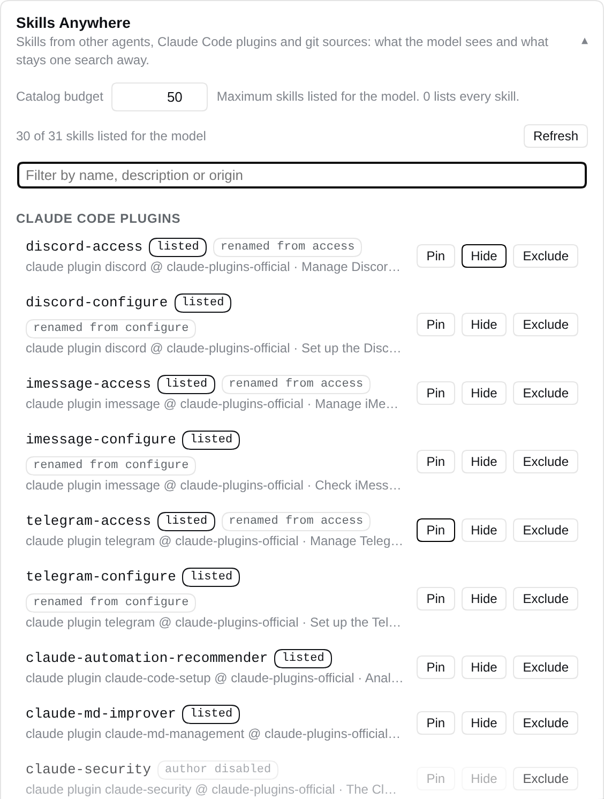

# dsh-skills-anywhere

**你的技能，随处可用。** [Agent Skill](https://agentskills.io) 装一次，所有 Agent 都能用：既是 [DeepSeek Harness](https://github.com/deepseek-ai/deepseek-harness)（`dsh`）的实时技能提供器，也是 Claude Code、Cursor、Codex 等的 MCP 服务器。

[English](README.md) | 中文

**[体验 Hugging Face 交互演示](https://huggingface.co/spaces/glayguo/dsh-skills-anywhere)**：在示例工作区中查看技能来源、处理重名、调整目录预算，并搜索未列出的技能。无需安装或模型 API。[演示原理](docs/HUGGINGFACE.md)。

[](https://github.com/noteflowai/dsh-skills-anywhere/actions/workflows/ci.yml)
[](https://www.npmjs.com/package/dsh-skills-anywhere)
[](https://github.com/topics/dsh-plugin)
[](https://scorecard.dev/viewer/?uri=github.com/noteflowai/dsh-skills-anywhere)
[](LICENSE)

Agent Skills 天生就是可移植的：一个带 `SKILL.md` 的文件夹。但每个 Agent 都只看自己的目录，于是你给 Claude Code 装的技能 Codex、Cursor 和 DeepSeek Harness 看不见，反过来也一样。`dsh-skills-anywhere` 直接从这些目录原地读取，然后把它们送到所有地方：在 dsh 里是一个实时的技能提供器，在 Claude Code、Cursor、Codex 等任何 MCP 客户端里是一个 MCP 服务器。

<p align="center"></p>

在 dsh 里，它在内置的 `ctx.skills` 注册表上多注册一个提供器，模型原有的 `skill` 工具和 `/name` 调用方式不变，只是能看到更多技能：

- **其他 Agent 的技能目录。** 开箱支持 60+ 个 Agent：Claude Code、Codex、Cursor、Gemini CLI、GitHub Copilot、Windsurf、Kiro、Goose、OpenCode、Roo、Cline、Qwen Code、Trae 等，项目级与用户级都覆盖。
- **Claude Code 插件市场。** 嵌套在 `~/.claude/plugins/marketplaces/*/plugins/*/skills/*` 里的技能，包括 Anthropic 官方市场。
- **任意装满技能的 git 仓库。** 指向 `anthropics/skills`、某个子目录、分支、标签或提交即可。浅克隆到本地缓存，后台刷新，并用 lock 文件锁定版本。
- **零拷贝、零软链接。** 文件在哪就从哪读取，每次加载都重新读。你在 Cursor 里改了技能，dsh 立刻看到。不需要导入，也不需要同步。

几百个技能会让每次模型请求都变得臃肿，所以提供器带有**目录预算**：默认最多 50 个技能进入模型的会话目录，其余的通过插件新增的两个小工具一次 `find_skills` 调用即可到达，`/name` 调用不受影响。

这套技能池**在 dsh 之外也能用**：`dsh-skills-anywhere mcp` 把它作为 [MCP](https://modelcontextprotocol.io) 服务器提供给任何 MCP 客户端（Claude Code、Cursor、Codex、Windsurf……），暴露 `find_skills` / `open_skill` 工具和 `skill://` 资源。技能装一次，所有 Agent 都能用。

它还会**去重**软链接和字节级相同的副本（`skills` CLI 会把同一份技能链接到多个 Agent）、**修复**常见的 frontmatter 偏差而不是悄悄丢掉技能，并对**同名冲突**（`discord/configure` 与 `telegram/configure`）自动加前缀，保证每个技能都能被调用。附带一个小 CLI，让你清楚看到 dsh 会看到什么、为什么。

## 快速开始

```sh
# 1. 安装到你使用的 dsh profile（web 是默认的 UI profile）
dsh plugin --profile web add dsh-skills-anywhere

# 2. 不启动 dsh，直接查看模型将看到的技能
npx dsh-skills-anywhere list

# 3. 添加一整个技能仓库
npx dsh-skills-anywhere add anthropics/skills
```

已发布到 [npm](https://www.npmjs.com/package/dsh-skills-anywhere)，带构建来源（provenance）签名；每个 [GitHub release](https://github.com/noteflowai/dsh-skills-anywhere/releases) 也附带同一个 tarball。

照常启动 dsh。技能目录里现在包含了上面所有内容；用 `skill` 工具或 `/技能名` 加载，与之前完全一样。

在一台只装了 Claude Code 的机器上，`list` 已经能找到官方插件市场里的 31 个技能，而这些 dsh 自己一个都看不到：

```
$ npx dsh-skills-anywhere list
NAME                 FROM                                                    PATH
discord-access       claude plugin discord @ claude-plugins-official         ~/.claude/plugins/marketplaces/.../discord/skills/access/SKILL.md
frontend-design      claude plugin frontend-design @ claude-plugins-official ~/.claude/plugins/marketplaces/.../frontend-design/skills/frontend-design/SKILL.md
skill-creator        claude plugin skill-creator @ claude-plugins-official   ~/.claude/plugins/marketplaces/.../skill-creator/skills/skill-creator/SKILL.md
...
31 skills, 6 renamed — run `dsh-skills-anywhere doctor` for details
```

<details>
<summary>不用 npm：从 git 检出或 release tarball 安装</summary>

每个 [GitHub release](https://github.com/noteflowai/dsh-skills-anywhere/releases) 都附带预构建的 tarball，`dsh plugin add` 和 `npx` 都可以直接使用它的 URL（`https://github.com/noteflowai/dsh-skills-anywhere/releases/download/v0.5.1/dsh-skills-anywhere-0.5.1.tgz`）。若需要尚未发布的提交：

```sh
dsh plugin --profile web add github:noteflowai/dsh-skills-anywhere
```

git 安装拿到的是源码，pnpm 需要运行本包的 `prepare` 构建脚本。pnpm 10+ 默认拒绝：第一次 `add` 会失败并打印出需要放行的精确键名（包含提交哈希）。把它原样复制到 profile 的 `pnpm-workspace.yaml` 后重新执行 `add`：

```yaml
# $DSH_HOME/profiles/web/pnpm-workspace.yaml
allowBuilds:
  'dsh-skills-anywhere@https://codeload.github.com/noteflowai/dsh-skills-anywhere/tar.gz/<sha>': true
```

需要可复现安装时请锁定提交：`github:noteflowai/dsh-skills-anywhere#<sha>`。

</details>

<details>
<summary>环境要求</summary>

- DeepSeek Harness `0.1.5-rc.1` 及以上（测试套件在 `0.1.5-rc.1` 和 `0.1.5-rc.2` 上通过），且 profile 挂载了 `@deepseek-ai/dsh-skill`（自带的 `web`、`acp`、`headless`、`sdk` profile 都满足）
- Node.js 22.19+ 或 24+
- git 源需要 `PATH` 中有 `git`（其余功能不依赖 git）

</details>

## 会发现哪些技能

| 位置 | 示例 | dsh source 标签 | 默认 rank |
|---|---|---|---|
| 其他 Agent 的**项目级**技能 | `<project>/.claude/skills/*` | `anywhere-project` | 250 |
| 其他 Agent 的**用户级**技能 | `~/.codex/skills/*`、`~/.cursor/skills/*` | `anywhere-user` | 550 |
| **Claude Code 插件市场**及已安装插件缓存 | `~/.claude/plugins/marketplaces/*/plugins/*/skills/*` | `anywhere-claude-plugins` | 580 |
| **git 源** | `anthropics/skills`、`vercel-labs/agent-skills/skills` | `anywhere-source` | 700 |

在 dsh 注册表里同名技能由 rank 小的胜出。内置根目录保留原有 rank（`.dsh/skills` 100、`.agents/skills` 200、`~/.dsh/skills` 400、`~/.agents/skills` 500），所以你专门为 dsh 写的技能永远优先于别处的同名技能。`.agents/skills` 与 `.dsh/skills` 不会被重复扫描。

运行 `npx dsh-skills-anywhere agents` 查看完整 Agent 表以及本机存在哪些目录。

### 技能格式

任何包含符合 [Agent Skills 规范](https://agentskills.io/specification) 的 `SKILL.md` 的目录，以及 dsh 的平铺 `<name>.md` 形式。支持 `name`、`description`、`license`、`compatibility`、`allowed-tools`、`metadata`，以及 dsh 的 `disable-model-invocation` / `user-invocable`。未知的 frontmatter 字段（如 Claude Code 的 `argument-hint`、`context`）保留在 `metadata.frontmatter` 下。`scripts/`、`references/`、`assets/` 与普通 dsh 技能一样通过资源目录暴露。

默认的**宽松模式**下：缺少 name 时回退到目录名，非法 name 归一化为 kebab-case，缺少 description 时取正文第一段。每次修复都会记录并由 `doctor` 展示。设置 `lenient: false` 可与内置提供器的严格行为保持一致。

## git 源

```sh
npx dsh-skills-anywhere add anthropics/skills                      # 默认分支
npx dsh-skills-anywhere add anthropics/skills@v1.0.0               # 标签或分支
npx dsh-skills-anywhere add vercel-labs/agent-skills/skills        # 子目录
npx dsh-skills-anywhere add https://github.com/o/r/tree/main/dir   # GitHub tree URL
npx dsh-skills-anywhere add git@gitlab.com:group/skills.git        # 任意 git URL
npx dsh-skills-anywhere add ./local/skills-repo --project          # 本地仓库，项目级
npx dsh-skills-anywhere add o/r --ref 3f2a9c1 --rank 300           # 锁定提交，设置优先级
```

源来自三个地方，按顺序合并：插件配置 `config.sources`、用户文件 `~/.dsh/skills-anywhere/sources.json`、项目文件 `<project>/.dsh/skills-anywhere.json`（提交到仓库即可与团队共享）。CLI 负责编辑后两者。

每个仓库只浅克隆一次到 `~/.dsh/skills-anywhere/cache/<host>/<owner>/<repo>`（指定了分支、标签或提交时为 `<repo>@<ref>`，同一仓库的多个 ref 不会共用一个检出），在 dsh 启动时、每隔 `syncIntervalMs`（默认 6 小时）以及源文件变化时刷新。每个源解析出的提交写入 `~/.dsh/skills-anywhere/lock.json`。发现过程只读缓存，因此刷新失败意味着"昨天的技能"，而不是空目录。刷新带来变化时立即使目录失效；dsh 永远不等待网络。

## 目录预算与 `find_skills` / `open_skill` 工具

dsh 会把每个模型可调用技能的名称和描述放进会话，每次请求都带上。加上插件市场和几个 git 源，这就是几百行上下文。因此提供器会对技能排序，只把前 `catalog.limit` 个（默认 50）标记为模型可调用；其余技能以关闭模型调用的方式发布，不进目录，但你仍可用 `/name` 加载。

由 `dsh-skills-anywhere/tools` 行注册的两个工具让模型也能触达被隐藏的部分：

- **`find_skills(query, limit?)`** 按关键词搜索全部技能（名称、描述、`whenToUse`、来源），无论是否在目录中，并标明哪些已列出。
- **`open_skill(name)`** 按精确名称加载任意技能，包括被预算隐藏的。frontmatter 里写了 `disable-model-invocation: true` 的技能仍会被拒绝，与内置 `skill` 工具行为一致。

```yaml
- id: skills-anywhere
  config:
    catalog:
      limit: 30                       # 0 = 不限制（旧行为）
      pin: [frontend-design]          # 始终列出
      hide: [example-skill]           # 从不列出，但仍可搜索、可 /name 调用
- id: skills-anywhere-tools
  config:
    findLimit: 10
```

作者禁用的技能不占预算。哪些技能保留在目录中遵循下文的优先级顺序：项目级优先于用户级，再优先于市场与 git 源。工具行依赖工具运行时（`ctx.tools`）；在没有它的 profile 中该行保持挂起，提供器独立工作。

## CLI

```
dsh-skills-anywhere list [--all] [--json]     提供器发布的技能（--all 显示被隐藏的重复项）
dsh-skills-anywhere agents [--json]           支持的 Agent 及本机存在的目录
dsh-skills-anywhere sources [--json]          已配置的 git 源及已同步的提交
dsh-skills-anywhere add <source> [--ref] [--path] [--rank] [--project]
dsh-skills-anywhere remove <source> [--project]
dsh-skills-anywhere sync [--force] [--json]   立即克隆或刷新全部源
dsh-skills-anywhere doctor [--json]           被修复、跳过、重命名、去重的技能及原因
dsh-skills-anywhere mcp                       通过 stdio 把同一批技能提供给任意 MCP 客户端
```

所有命令支持 `--cwd <dir>` 指定项目。CLI 与插件走同一套代码，无需 dsh 运行。

## 作为 MCP 服务器使用

技能不是 dsh 独有的概念，这个提供器也不是。`dsh-skills-anywhere mcp` 启动一个基于 stdio 的 [Model Context Protocol](https://modelcontextprotocol.io) 服务器，把完全相同的技能池（Agent 目录、Claude Code 市场、git 源，以及同样的去重与重命名规则）提供给任何 MCP 客户端：

| 工具 | 作用 |
| --- | --- |
| `list_skills` | 浏览全部允许模型调用的技能及其描述、来源（支持 `limit`、`offset`） |
| `find_skills` | 按关键词搜索名称、描述与来源 |
| `open_skill` | 加载某个技能的完整指令，以及其脚本和参考文件所在目录 |

技能同时以 `skill://<名称>` 资源（带自动补全）暴露，方便支持 @ 引用资源的客户端。frontmatter 设置了 `disable-model-invocation: true` 的技能永远不会被列出或打开。该服务器完全不需要安装 dsh。

**Claude Code**（作为插件安装；本仓库同时也是一个插件市场）

```sh
claude plugin marketplace add noteflowai/dsh-skills-anywhere
claude plugin install dsh-skills-anywhere@noteflowai
```

也可以只注册裸服务器：`claude mcp add skills-anywhere -- npx -y dsh-skills-anywhere mcp`。两种方式都需要重启一次 Claude Code 才会连接。

**Cursor**（`.cursor/mcp.json` 或 `~/.cursor/mcp.json`）

```json
{ "mcpServers": { "skills-anywhere": { "command": "npx", "args": ["-y", "dsh-skills-anywhere", "mcp"] } } }
```

**Codex**（`~/.codex/config.toml`）

```toml
[mcp_servers.skills-anywhere]
command = "npx"
args = ["-y", "dsh-skills-anywhere", "mcp"]
```

服务器也已登记在 [MCP 官方目录](https://registry.modelcontextprotocol.io)，名称为 `io.github.noteflowai/dsh-skills-anywhere`，支持该目录的客户端可以按名字安装。仓库同时是一个 [Agent Plugin](https://agent-plugins.org)（根目录的 `plugin.json` 与 `mcp.json`），Cursor 等支持开放插件规范的客户端可以直接用仓库地址安装。如果客户端不是在当前项目目录里启动服务器，加上 `--cwd <dir>`。git 源会像在 dsh 中一样在启动时后台同步。编程方式：`import { createSkillsAnywhereServer } from 'dsh-skills-anywhere/mcp'` 会返回 `McpServer` 和提供器，可自行挂接传输层。

## 在 dsh web 界面里浏览和开关技能

在 `dsh web` 中打开 **设置 → 插件 → 插件配置**，**Skills Anywhere** 卡片会列出提供器找到的全部技能，按所在位置分组（Agent 目录、Claude Code 插件、git 源），并标出目录状态——*已列出*给模型、*未列出*（被预算或你挡在目录外）或*作者禁用*——以及重名时被改成的名字。每一行提供 **置顶**（始终列出）、**隐藏**（不进模型目录，但 `/名称` 和 `find_skills` 仍可达）和 **排除**（从提供器中彻底去掉）；目录预算可以就地修改，筛选框按名称、描述和来源搜索。

<p align="center"></p>

修改会作为 `skills-anywhere` 命名空间写入 profile 的 dsh 设置文档，叠加在 `cordis.patch.yml` 的 `catalog` 和 `excludeSkills` 之上，模型目录立即跟随变化：无需重启，无需手改文件。卡片只在挂载了 dsh 设置服务和 web 服务器的 profile 中出现（自带的 `web` profile 满足）；其他场合提供器的行为与组合配置完全一致。

## 配置

在 profile 的 `cordis.patch.yml` 中覆盖该行。patch 会替换整个 `config` 块，因此需要写全所有你关心的键：

```yaml
- id: skills-anywhere
  config:
    agents: true
    excludeAgents: [openclaw]
    claudePlugins: true
    sources:
      - anthropics/skills
      - { repo: vercel-labs/agent-skills, path: skills, ref: main, rank: 650 }
    excludeSkills: [example-skill]
```

| 字段 | 默认值 | 含义 |
|---|---|---|
| `providerName` | `skills-anywhere` | 在 `ctx.skills` 上的提供器名 |
| `agents` | `true` | 扫描其他 Agent 的技能目录 |
| `excludeAgents` | `[]` | 跳过的 Agent id（见 `agents` 命令） |
| `extraProjectDirs` | `[]` | 额外的项目相对技能目录 |
| `extraUserDirs` | `[]` | 额外的绝对路径或 `~/` 技能目录 |
| `claudePlugins` | `true` | 扫描 Claude Code 插件市场与缓存 |
| `sources` | `[]` | git 源：字符串或 `{ repo, ref?, path?, rank? }` |
| `sourcesFiles` | `true` | 同时读取用户级与项目级 `sources.json` |
| `cacheDir` | `~/.dsh/skills-anywhere/cache` | 源的检出位置 |
| `sync` | `true` | 是否克隆/刷新 git 源 |
| `syncOnStart` | `true` | 插件启动及项目首次使用时刷新 |
| `syncIntervalMs` | `21600000` | 后台刷新间隔；`0` 表示关闭 |
| `syncTimeoutMs` | `120000` | 单条 git 命令超时 |
| `maxDepth` | `5` | 源与市场内的目录遍历深度 |
| `dedupe` | `true` | 折叠软链接与字节相同的重复项 |
| `lenient` | `true` | 修复可恢复的 frontmatter 而不是跳过 |
| `watch` | `true` | 监视本地根目录，变化时刷新目录 |
| `excludeSkills` | `[]` | 要隐藏的技能名（原始 frontmatter 名或 `list` 显示的发布名均可）；可在 web 卡片中运行时修改 |
| `ranks` | `{ project: 250, user: 550, claudePlugins: 580, sources: 700 }` | 各组优先级 |
| `catalog.limit` | `50` | 本提供器进入模型目录的技能数；`0` = 不限制 |
| `catalog.pin` | `[]` | 始终列出的名称 |
| `catalog.hide` | `[]` | 从不列出的名称（仍可 `/name` 调用和搜索） |
| `dshHome`、`home` | `$DSH_HOME` / `~` | 路径根，主要用于测试 |

`dsh-skills-anywhere/tools` 行接受 `findLimit`（默认 10）、`findMaxLimit`（50），以及 `find` / `open` 布尔值以便只注册其中一个工具。

## 优先级与去重规则

1. 按 rank 顺序扫描根目录；同一 rank 内按 Agent 表顺序，再按路径。
2. 指向**同一文件**（软链接）的条目折叠为第一个；**同名且正文字节相同**的条目折叠为第一个。两者都在 `doctor` 中显示为隐藏的重复项。
3. 仍然**同名**但内容不同的条目全部保留。如果其中有你自己的（来自 Agent 目录），它保持原名，其余加上插件、仓库或 Agent 前缀（如 `telegram-configure`）；如果全部来自市场或 git 源，则全部加前缀，得到 `discord-access`、`telegram-access` 而不是一个没有意义的 `access`。`doctor` 会列出重命名。
4. 随后 dsh 注册表按 rank 把本提供器的候选与内置候选合并。

## 安全说明

- 插件只**读取**技能文件，绝不写入你的 Agent 目录。
- git 源会在插件启动和刷新周期在本机运行 `git`。对不完全信任的源请锁定提交，并检查 `lock.json`。
- 技能是模型会遵循的指令。添加一个源就是一次信任决策，与安装插件无异。
- 技能通过 Node 文件系统 API 读取，而非 dsh 沙箱化的 `ctx.fs`；内置提供器读取自带根目录时也是如此。

## 开发

```sh
pnpm install
pnpm run check        # 类型检查 + lint + 测试 + 构建
pnpm pack             # 生成 tarball，供 `dsh plugin --profile <name> add ./dsh-skills-anywhere-*.tgz`
```

测试直接跑在真实的 `@deepseek-ai/dsh-skill` 注册表和临时目录里的真实 git 仓库上。

## 参与贡献

欢迎 issue 与 PR。新增一个 Agent 只需在 [`src/agents.ts`](src/agents.ts) 里加一行。详见 [CONTRIBUTING.md](CONTRIBUTING.md)。

## 许可证

[MIT](LICENSE) © Note Flow AI
