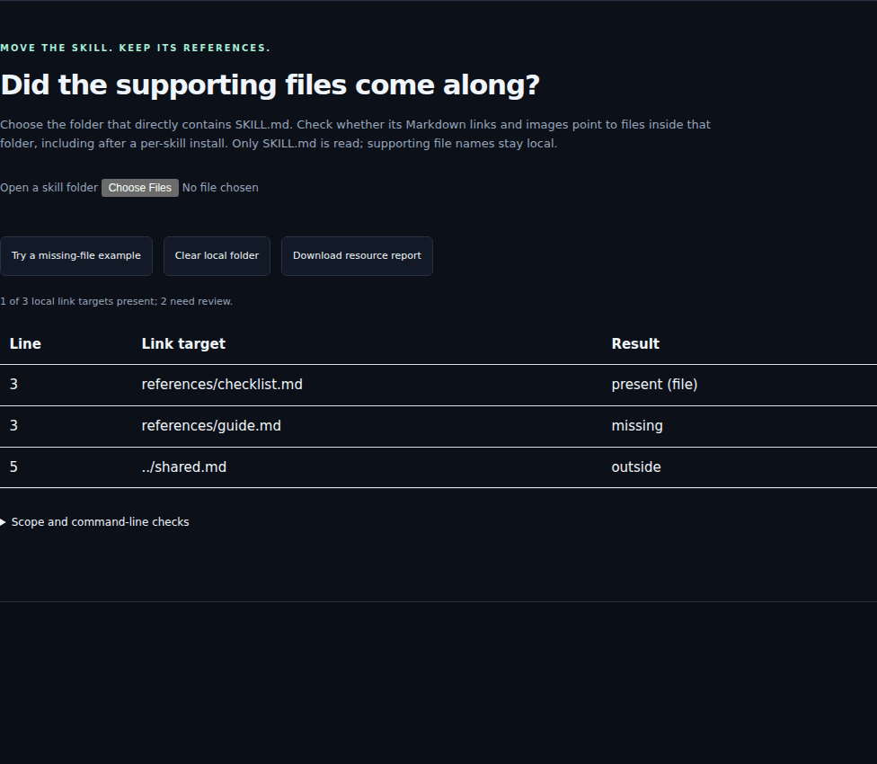

# Check a skill's supporting files



Copying `SKILL.md` alone can leave its local links unresolved. Check the installed
folder before loading it into an agent:

```sh
npx dsh-skills-anywhere@0.15.0 check path/to/SKILL.md --resources --json
npx dsh-skills-anywhere@0.15.0 check path/to/SKILL.md --fail-on-resource-issues
```

The first command lists findings without failing a valid skill. The second makes
missing, outside, symlink, invalid and unavailable targets fail the check (exit 1).
Unreadable input uses exit 2. It implies `--resources`.

## In a pull request

```yaml
- uses: noteflowai/dsh-skills-anywhere@v0.15.0
  with:
    files: skills/**/SKILL.md
    resources: true
    fail-on-resource-issues: true
```

For stricter workflow pinning, replace the release tag with its reviewed commit.
Annotations point to the link's source line. The JSON report adds a `resources`
object per readable file; resource findings remain separate from metadata parsing.

## What is checked

CommonMark links, images and used reference definitions in `SKILL.md` are resolved
relative to its directory. YAML frontmatter, code examples and HTML are excluded.
Percent-encoded destinations are decoded once; queries and fragments are ignored.
Remote links are not fetched. An in-root directory can be present. Outside paths
are not inspected, and the CLI refuses to follow linked symlink components.
The checks inspect file metadata only, not the linked contents. This is a snapshot
of available targets, not a security boundary against concurrent filesystem changes.

Paths written in prose or code, links inside supporting files, heading anchors,
package dependencies, executable behavior and instruction quality are not checked.
**Zero discovered links means zero assessed links**, not a complete dependency pass.
A present target can still contain unsuitable instructions or broken code.

The browser folder picker reads only `SKILL.md` and the selected file names, locally.
It cannot identify symlinks or see empty directories. Use the CLI when those details
matter. Neither path executes the skill or sends local files to a server.
Limits: 128 KiB per SKILL.md, 1,000 local references, 10,000 browser-selected files.

## Reproduce the three public examples

See [pinned snapshots and results](../examples/resource-portability/README.md).
The same parser powers the CLI and browser. Follow the resource check with a
[bundle comparison](BUNDLES.md) when reviewing content changes before MCP loading.

## 中文

先检查安装目录，再加载技能：`--resources` 只列出本地 Markdown 链接问题；
`--fail-on-resource-issues` 显式开启 CI 门禁。浏览器目录选择器仅在本地读取
SKILL.md 和文件名，无法识别符号链接或空目录。正文、代码中的路径、附件内的
递归依赖、内容质量和执行行为不在检查范围内。零个链接不代表所有依赖完整。
