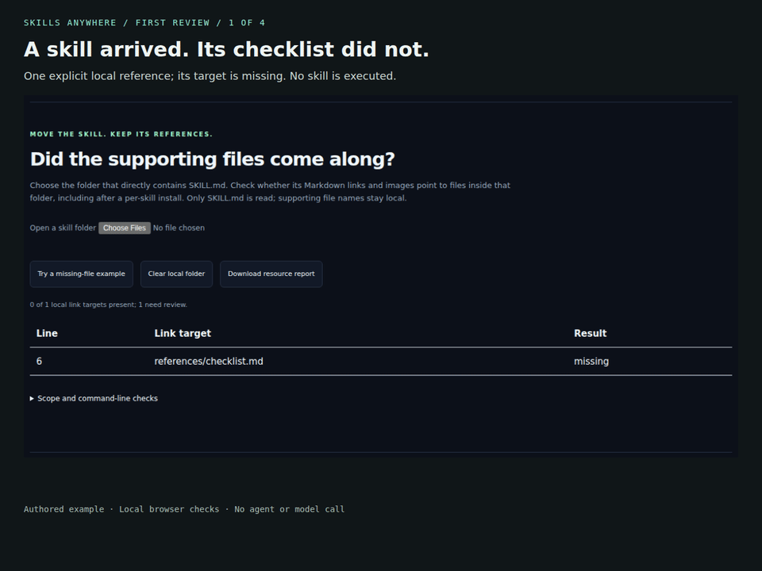

# Your first resource check

Start with the published CLI and one small skill. You will see one missing
Markdown target, restore it, and run the same gate again. No agent account,
model call or repository checkout is needed.

[Try the browser](https://huggingface.co/spaces/glayguo/dsh-skills-anywhere) ·
[30-second walkthrough](assets/ai-first-review.mp4)



## 1. Create a skill with a missing checklist

Use Node.js 22.19+ or 24+. These commands use Bash on Linux/macOS. Start in a new
directory; the example never loads or executes the skill.

```sh
mkdir skills-first-check && cd skills-first-check
mkdir review-skill
node -e "require('node:fs').writeFileSync('review-skill/SKILL.md', '---\nname: review-skill\ndescription: Use when reviewing a change against the accompanying checklist.\n---\n\nRead [the checklist](references/checklist.md) before reviewing the change.\n', {flag:'wx'})"
npx --yes dsh-skills-anywhere@0.15.0 check review-skill/SKILL.md --resources --json
```

The report has **one local reference, zero present targets and one issue**.
`--resources` reports the missing file while returning 0 for this valid skill.
Turn the finding into an explicit gate:

```sh
npx --yes dsh-skills-anywhere@0.15.0 check review-skill/SKILL.md --fail-on-resource-issues
```

**Expected exit: 1.** This is the missing-target finding, not an installation
failure. An unreadable input instead returns 2.

## 2. Restore the referenced file

```sh
node -e "const fs=require('node:fs'); fs.mkdirSync('review-skill/references'); fs.writeFileSync('review-skill/references/checklist.md', '# Checklist\n\n- Confirm the requested change.\n- Record what was checked.\n', {flag:'wx'})"
npx --yes dsh-skills-anywhere@0.15.0 check review-skill/SKILL.md --fail-on-resource-issues --json
```

**Expected exit: 0**, with one present target and zero resource issues. This
establishes that the referenced file is available; it does not assess the
instructions, the checklist's quality or an agent's performance.

In the browser, choose `review-skill` with **Open a skill folder** before and
after restoring the file. Download the resource report to keep the finding.
The file contents and names stay in the browser.

## 3. Use the check in a pull request

Commit the skill and its supporting file, then add the check after checkout:

```yaml
steps:
  - uses: actions/checkout@v4
  - uses: noteflowai/dsh-skills-anywhere@v0.15.0
    with:
      files: review-skill/SKILL.md
      fail-on-resource-issues: true
```

Use a reviewed full commit SHA when your repository requires immutable Action
pinning. To try real upstream material, continue with the
[three pinned skill snapshots](../examples/resource-portability/README.md).

## What the walkthrough shows

The 30-second video consists of four annotated screenshots of the actual browser:
the missing target, a downloaded finding, the restored target and the available
CLI gate. It has no audio. Captions are in
[WebVTT](assets/ai-first-review.vtt); file hashes, inputs and the capture method
are recorded in [the media record](assets/ai-first-review-media.json).
Rebuild it with `scripts/capture_ai_walkthrough.cjs` after building the showcase.

Only explicit local Markdown references are checked. Paths in prose/code,
recursive dependencies and execution behavior are outside this check.
Zero discovered links means zero assessed links.
[Full scope and limits](RESOURCES.md).

## 中文快速开始

上面的命令可以直接使用已发布的 `0.15.0`，无需克隆仓库或调用模型：

1. 在新目录创建示例技能。`--resources` 会报告 1 个缺失引用，但不阻断。
2. 使用 `--fail-on-resource-issues`，此时退出码 **1 是预期结果**。
3. 补回 `references/checklist.md` 后再检查，退出码为 **0**，引用变为存在。
4. 把相同门禁加入 PR。浏览器也可选择这个目录并下载检查报告。

文件存在不代表内容合适或技能执行成功。短演示使用真实页面截图及说明字幕，
没有执行技能，也没有上传本地文件。
